# Mycelix v6.0 Architecture

This document provides visual diagrams of the Living Protocol Layer architecture.

## System Overview

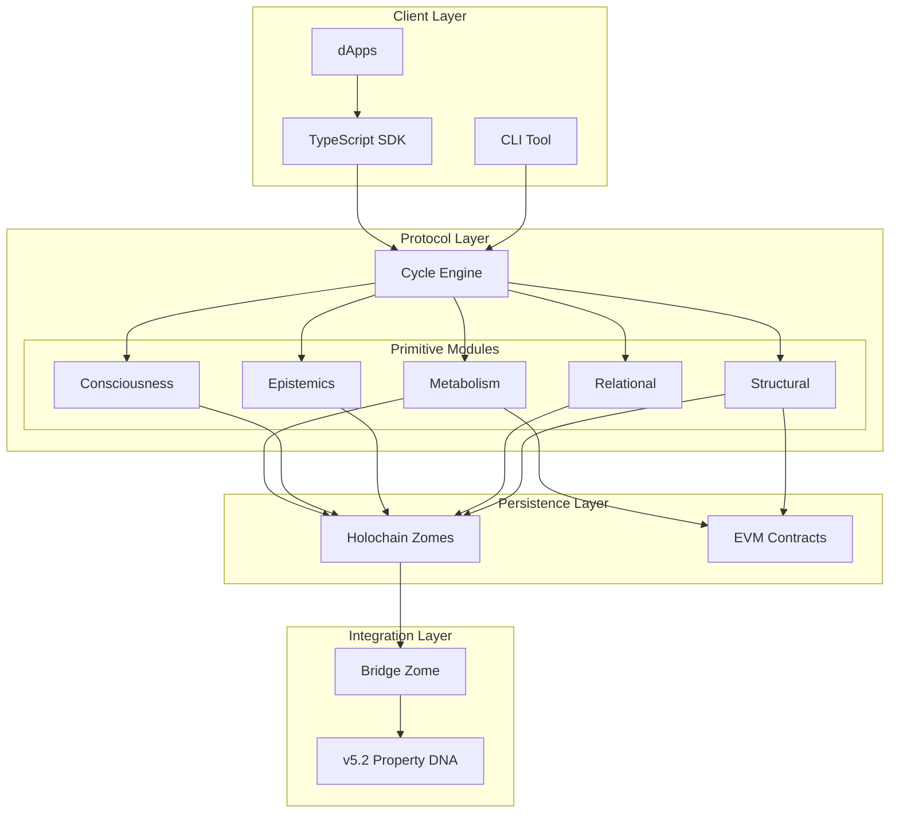

## 28-Day Metabolism Cycle

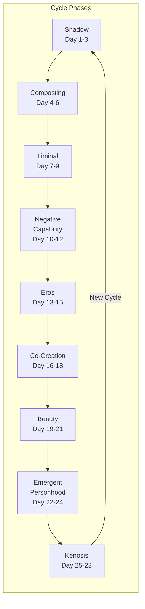

## Data Flow

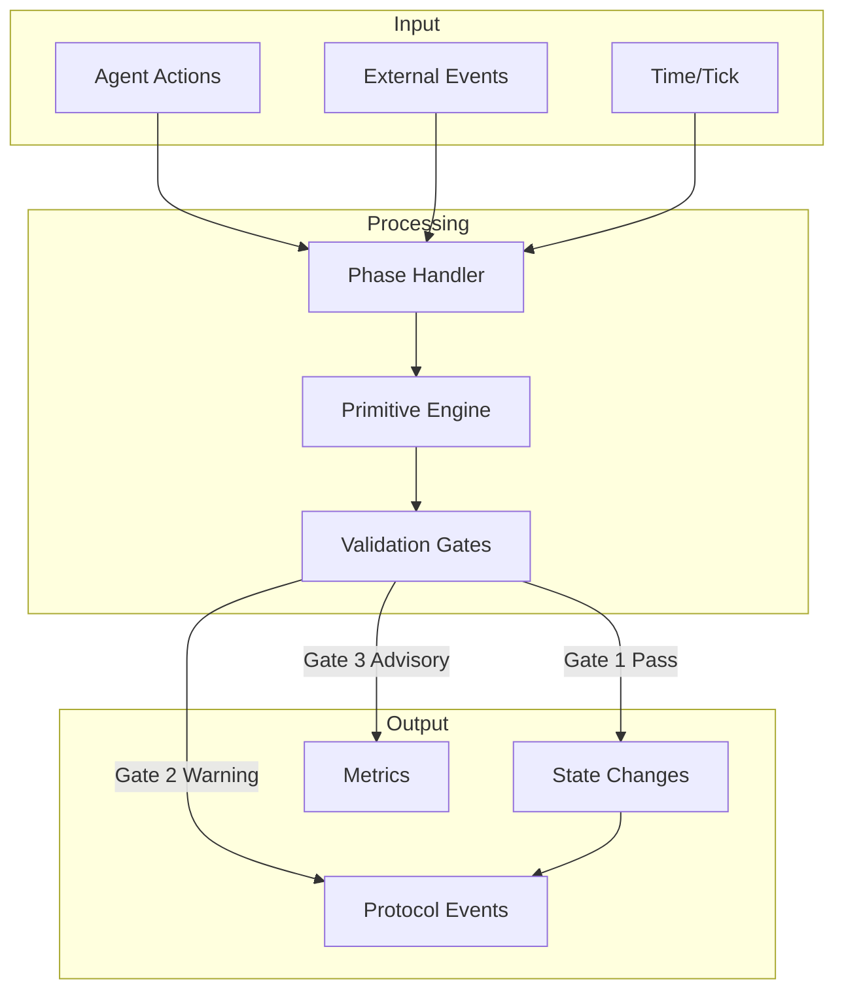

## Primitive Dependencies

```mermaid
graph TD
    subgraph "living-core"
        TYPES[Types]
        EVENTS[Events]
        ERRORS[Errors]
        CONFIG[Config]
    end

    subgraph "metabolism"
        COMP[Composting]
        WOUND[Wound Healing]
        TRUST[Metabolic Trust]
        KEN[Kenosis]
    end

    subgraph "consciousness"
        KVEC[Temporal K-Vector]
        FIELD[Field Interference]
        DREAM[Collective Dreaming]
        PHI[Emergent Personhood]
    end

    subgraph "epistemics"
        SHADOW[Shadow Integration]
        NEGCAP[Negative Capability]
        SILENCE[Silence Signaling]
        BEAUTY[Beauty Validity]
    end

    subgraph "relational"
        ENTANGLE[Entangled Pairs]
        EROS[Eros Attractor]
        LIMINAL[Liminality]
        INTER[Inter-Species]
    end

    subgraph "structural"
        RESONANCE[Resonance Addressing]
        FRACTAL[Fractal Governance]
        MORPHO[Morphogenetic Fields]
        CRYSTAL[Time Crystals]
        MYCELIAL[Mycelial Computation]
    end

    TYPES --> COMP & WOUND & TRUST & KEN
    TYPES --> KVEC & FIELD & DREAM & PHI
    TYPES --> SHADOW & NEGCAP & SILENCE & BEAUTY
    TYPES --> ENTANGLE & EROS & LIMINAL & INTER
    TYPES --> RESONANCE & FRACTAL & MORPHO & CRYSTAL & MYCELIAL

    EVENTS --> COMP & WOUND & KEN
    CONFIG --> COMP & WOUND & TRUST & KEN
```

## Wound Healing State Machine

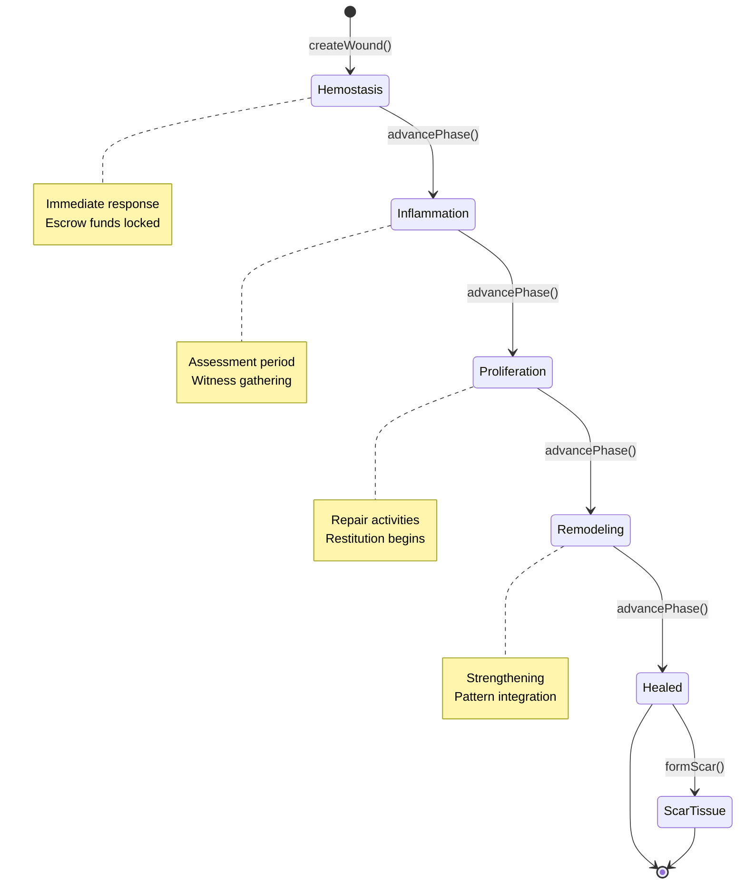

## Liminal Transition States

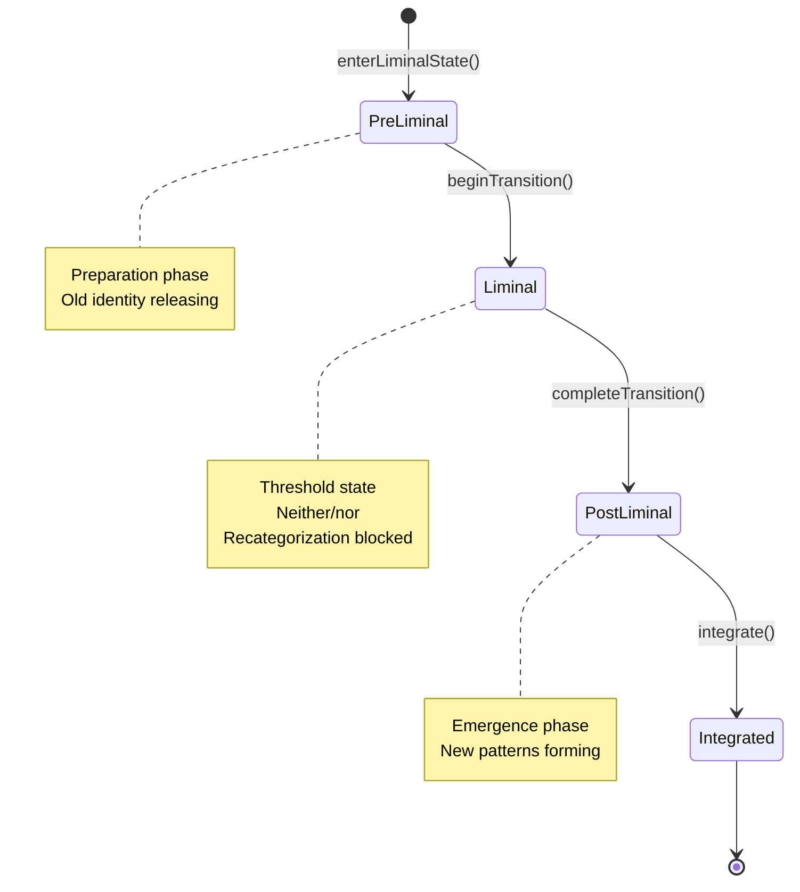

## K-Vector Dimensions

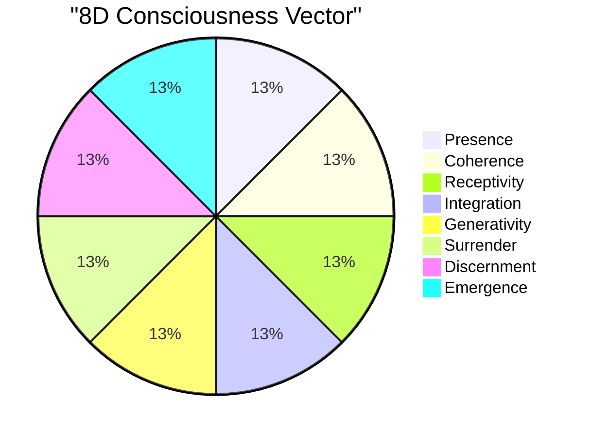

## Cross-DNA Integration

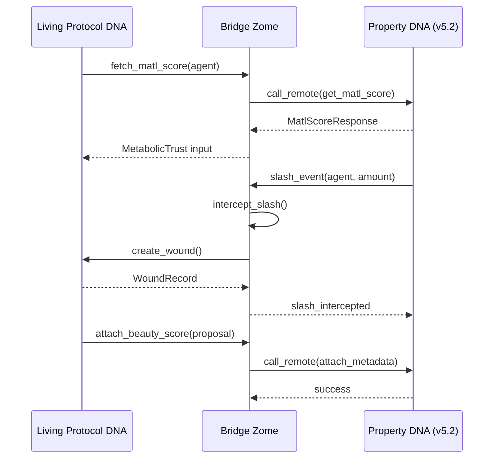

## Gate System Flow

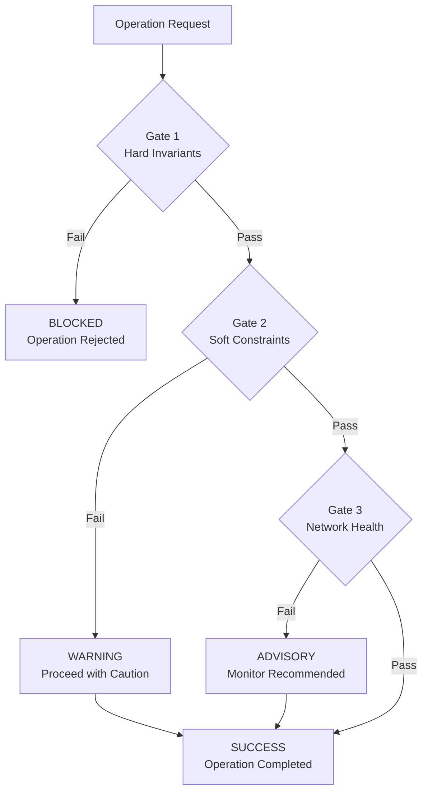

## Holochain Zome Architecture

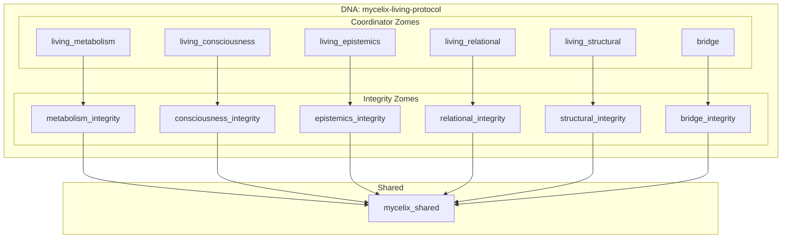

## Solidity Contract Interactions

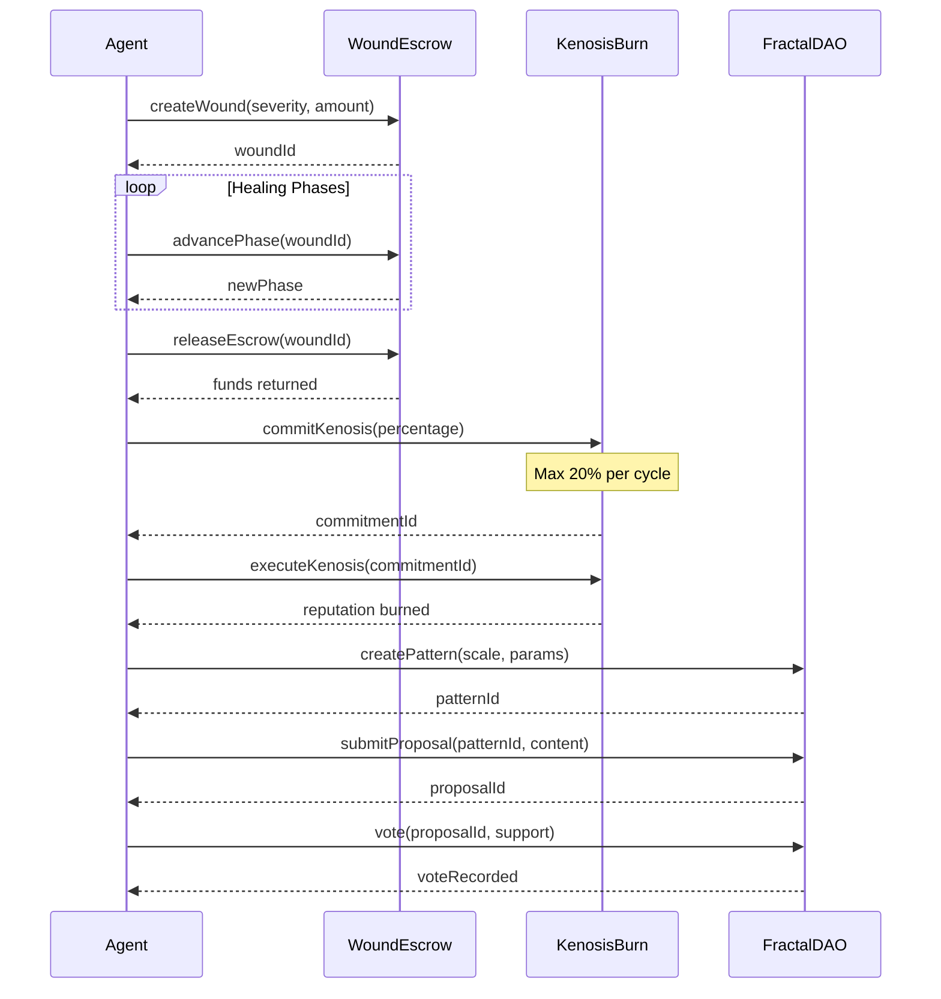

## Event Bus Architecture

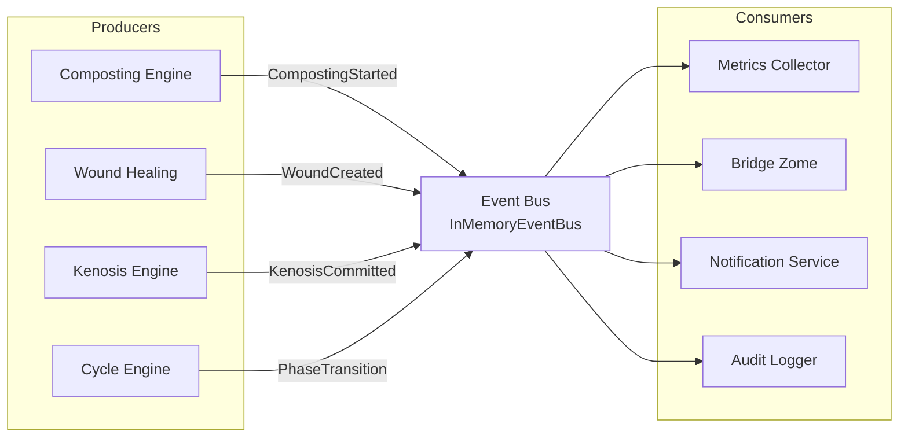

## Deployment Architecture

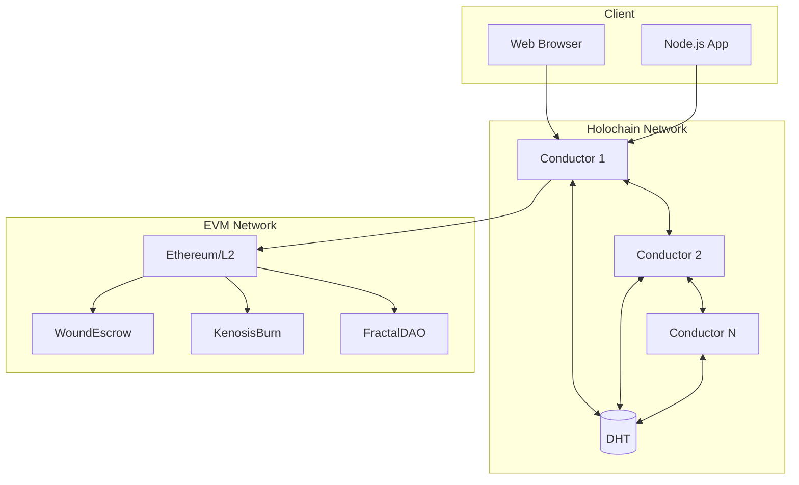

---

These diagrams can be rendered using any Mermaid-compatible viewer, including:
- GitHub markdown
- GitLab markdown
- VS Code with Mermaid extension
- [Mermaid Live Editor](https://mermaid.live)
